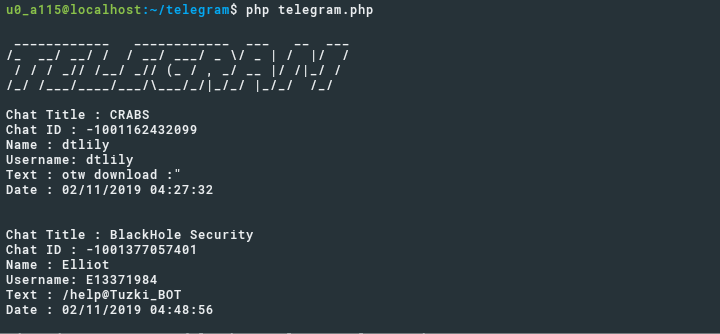

# MenheraBot
> PHP telegram Bot

PHP telegram for cli/web



## Installation

OS X & Linux:

```sh
git clone https://github.com/Cvar1984/MenheraBot.git
```

Windows:

```sh
git clone https://github.com/Cvar1984/MenheraBot.git
```

## Usage example

Edit and cinfig your api key at telegram.php
php telegram.php

## Development setup

install composer
```sh
sudo apt install composer
cd MenheraBot
conposer install
```

## Release History

* 0.2.1
    * CHANGE: adjust `antibot`
    * ADD: `/zodiac /sexsxope /bussines /finance`
* 0.2.0
    * CHANGE: Remove `setDefaultXYZ()`
    * ADD: Add `/quote /pinterest /ytmp3`
* 0.1.1
    * FIX: Crash when calling `/demote` (Thanks @Cvar1984!)
* 0.0.1
    * Work in progress

## Meta

Your Name – [@E13371984](https://t.me/E13371984) – gedzsarjuncomuniti@gmail.com

Distributed under the GPL license. See ``LICENSE`` for more information.

[https://github.com/Cvar1984/MenheraBot](https://github.com/Cvar1984/MenheraBot)

## Contributing

1. Fork it (<https://github.com/yourname/yourproject/fork>)
2. Create your feature branch (`git checkout -b feature/fooBar`)
3. Commit your changes (`git commit -am 'Add some fooBar'`)
4. Push to the branch (`git push origin feature/fooBar`)
5. Create a new Pull Request

